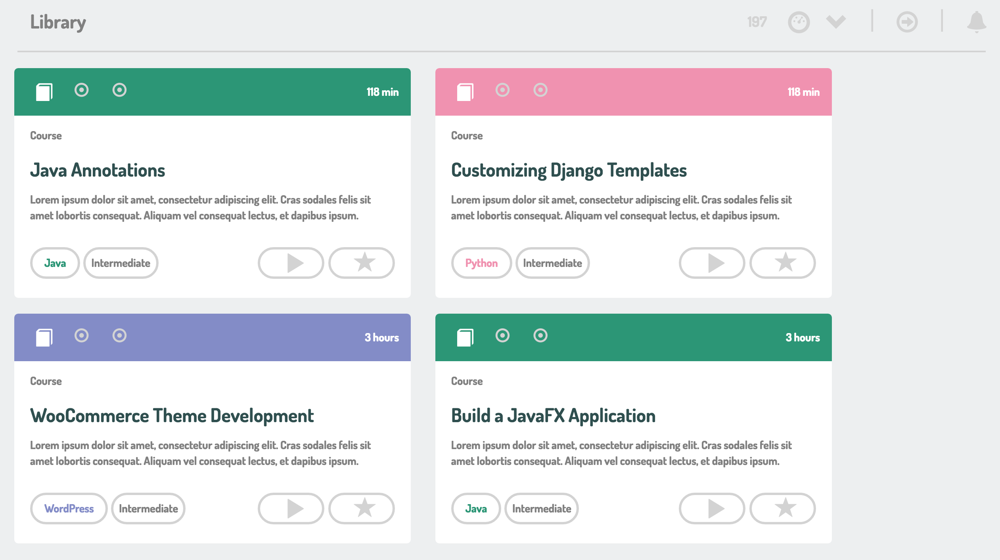

# _CSS Treehouse mimic PRACTICE using floats and inline-block_

#### By _Kyle Lange and Garrett Price_

## Description

_A project to practice floats and inline-block to mimic a page from treehouse.com._

## Setup/Installation Requirements

* _Copy the repository from GitHub_
* _Open in code editor of your choice_
* _Change the project name (and other info as necessary) in the package.json and bower.json files_
* _Run npm install_
* _run bower install_
* _run gulp build to build the project for the first time and gulp serve to start the development server_

## Support and contact details

For questions, concerns, or suggestions please email baronsintrees@gmail.com

## Known Bugs

_The hover tags are not yet responsive and are not in the correct place on most screen sizes._

## Technologies Used

* HTML5
* CSSS (sass)

## Licensing

* MIT

Copyright (c) 2016 **_Kyle Lange and Garrett Price_**
